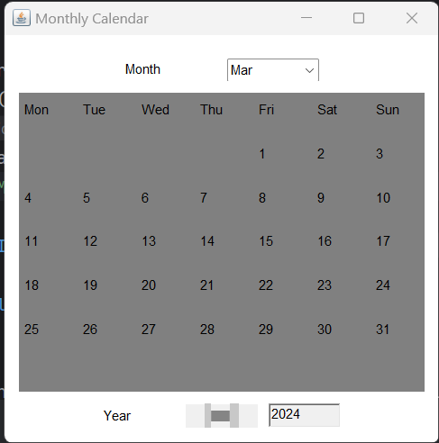

**Monthly Calendar README**

### Introduction
This README provides an overview of the Monthly Calendar application developed using Java. The application generates a monthly calendar for a specified year and month.

### Features
1. **Calendar Generation**: Generates a calendar for a specified year and month.
2. **Customizable Display**: The generated calendar displays the days of the month along with the day of the week.
3. **User Input**: Users can specify the year and month for which they want to generate the calendar.

### Requirements
- Java Development Kit (JDK) installed on your system.
- Java IDE (Integrated Development Environment) such as Eclipse, IntelliJ IDEA, or NetBeans.

### How to Run the Application
1. **Clone the Repository**: Clone or download the repository 

2. **Open in IDE**: Open the project in your preferred Java IDE.

3. **Compile and Run**: Compile and run the `MonthlyCalendar.java` file.

4. **Usage**: Once the application is launched, it will prompt the user to input the year and month for which they want to generate the calendar. After entering the required information, the calendar will be displayed.

### User Guide
- **Input**: Follow the prompts to input the year and month for which you want to generate the calendar.
- **Calendar Display**: The generated calendar will display the days of the specified month along with the corresponding day of the week.

- **Navigation**: Use the generated calendar to navigate through the days of the month.

### Contributing
Contributions to the project are welcome. If you find any issues or have suggestions for improvements, feel free to open an issue or create a pull request.

### Acknowledgments
- The project is inspired by the need for a simple and customizable monthly calendar generator.
- Thanks to the developers and contributors of Java for providing the tools and libraries necessary for development.

### Contact
For any inquiries or support, please contact [rupammodak1@gmail.com].

Enjoy using our Monthly Calendar application! 📅
